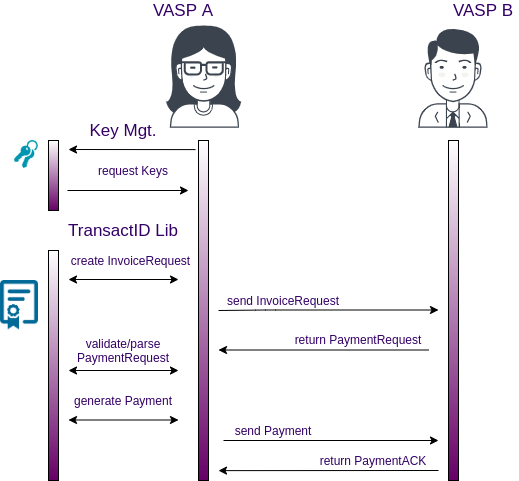

# TransactID Library Java Edition

 


[](https://mvnrepository.com/artifact/com.netki/transactid)


This Netki TransactID Library provides convenient and simple implementation of the [BIP70][1] and [BIP75][2] protocol definitions.

We have packaged all the necessary functionality needed to deploy a protocol compliant version of the BIP.  This library will take care of the difficult cryptographic communication and implementation parts of implementing the above protocols.

What we provide:

* Networking layers
* [Protocol Buffers][4] wiring and definitions
* Key signing with [EC cryptography][5]


## Travel Rule

International regulatory bodies have determined that the cryptocurrency and blockchain finance sectors are beholden to the same rules as the traditional finance institutions.  We have provided this library to help with the implementation of the ["Travel Rule" 31 CFR 103.33(g) ][6] clause of the [Bank Secrecy Act][7].

## TransactID Travel Rule Features

We have taken a security and privacy first approach to the development of this library.  Your customers' data and secrets are very important to us. 

We are also blockchain people at heart.  We value the philosophies and strategies of the decentralized nature of the blockchain and will NOT lock you into a vendor specific protocol. Which is why we relay on standardized formats. 

* Blockchain and coin agnostic - any coin, any chain, any token
* Identity safety - the identity of the parties is only shared between the parties and not a centralized outside source
* PII retention - the PII of your customers will never be written to the blockchain
* PII control - the protocol and library give you the ability to control how much data is shared
* PII security - we employ the highest level of cryptographic and architectural security


## Basics of BIP75

Implementation that might otherwise be complicated is taken care of by the library itself.  It is, however, important to understand some of the basic algorithms and workflow dynamics that are going on under the hood. 


### Terminology

We have standardized on the terminology referenced in both [BIP70][1] and [BIP75][2].  It is beneficial to understand these terms so that they may be referenced below. 

Normally the communication will happen between two parties.  Two VASPs or parties are represented in the models.  It can be thought of as a buyer/seller arragement but does not necessarily have to be. 

* InvoiceRequest - VASP A (payer) will start the transaction
* PaymentRequest - VASP B (receiver) resposne asking for payment of a defined value
* Payment - this model represents the actual transaction that goes onto the blockchain
* PaymentACK - the response back from VASP B letting A know that the payment was acknowledged

### Workflow

A graph of the workflow is probably the best way to visualize what is going on. 




## Quick Start

Installation of the Netki TransactID Travel Rule Library is straight forward. We support `Maven` and `gradle`


### Maven Users

If you are using maven you can download the latest JAR or grab via [Maven][3]:

```xml
<dependency>
    <groupId>com.netki</groupId>
    <artifactId>transactid</artifactId>
    <version>0.1.0-alpha0</version>
    <type>pom</type>
</dependency>
```

### Gradle Users

```sh
compile group: 'com.netki', name: 'transactid', version: '0.1.0-alpha0', ext: 'pom'
```

## General Usage

To use the methods to create the BIP messages you can use the static methods in the class TransactId for example:

```java
val transactIdInstance = TransactId
transactIdInstance.isInvoiceRequestValid(invoiceRequestBinary)
```

Alternatively: 

```java
TransactId.isInvoiceRequestValid(invoiceRequestBinary)
```

There are three main method types that you'll use: create\*, is\*Valid, and parse\*.

## Invoice Request

Please refer to the [BIP75][2] documentation for detailed requirements for a `InvoiceRequest`.

Create an object for sending like so:

```java
/**
 * Create InvoiceRequest message.
 *
 * @param invoiceRequestParameters data to create the InvoiceRequest.
 * @param ownerParameters of the accounts for this transaction.
 * @param senderParameters of the protocol message.
 * @return binary object of the message created.
 * @throws InvalidOwnersException if the provided list of owners is not valid.
 */
@Throws(InvalidOwnersException::class)
fun createInvoiceRequest(
    invoiceRequestParameters: InvoiceRequestParameters,
    ownerParameters: List<OwnerParameters>,
    senderParameters: SenderParameters
): ByteArray
```


This will provide you with a serialized binary that you can then send to someone else who is able to
parse and validate one of these things.

When you are on the receiving end of one of those binary strings you can do the following to validate
the signature and parse one:

```java
/**
 * Validate if a binary InvoiceRequest is valid.
 *
 * @param invoiceRequestBinary binary data to validate.
 * @return true if is valid.
 * @exception InvalidObjectException if the binary is malformed.
 * @exception InvalidSignatureException if the signature in the binary is not valid.
 * @exception InvalidCertificateException if there is a problem with the certificates.
 * @exception InvalidCertificateChainException if the certificate chain is not valid.
 */
@Throws(
    InvalidObjectException::class,
    InvalidSignatureException::class,
    InvalidCertificateException::class,
    InvalidCertificateChainException::class
)
fun isInvoiceRequestValid(invoiceRequestBinary: ByteArray): Boolean
```


This will return true if there are no errors in the object and the signature is valid.

To access the data from the `InvoiceRequest` just do:

```java
/**
 * Parse binary InvoiceRequest.
 *
 * @param invoiceRequestBinary binary data with the message to parse.
 * @return InvoiceRequest parsed.
 * @exception InvalidObjectException if the binary is malformed.
 */
@Throws(InvalidObjectException::class)
fun parseInvoiceRequest(invoiceRequestBinary: ByteArray): InvoiceRequest
```

And that will return a object with all of the fields of the `InvoiceRequest` and the values that were
filled in.

## Payment Request

Please refer to the [BIP70][1] documentation for detailed requirements for a `PaymentRequest`.

Create an object for sending like so:

```java
/**
 * Create binary PaymentRequest.
 *
 * @param paymentParameters data to create the PaymentRequest.
 * @param ownerParameters of the accounts for this transaction.
 * @param senderParameters of the protocol message.
 * @param paymentParametersVersion version of the PaymentDetails message.
 * @return binary object of the message created.
 * @throws InvalidOwnersException if the provided list of owners is not valid.
 */
@Throws(InvalidOwnersException::class)
fun createPaymentRequest(
    paymentParameters: PaymentParameters,
    ownerParameters: List<OwnerParameters>,
    senderParameters: SenderParameters,
    paymentParametersVersion: Int = 1
): ByteArray
```

This will provide you with a serialized binary that you can then send to someone else who is able to
parse and validate one of these things.

When you are on the receiving end of one of those binary strings you can do the following to validate
the signature and parse one:

```java
/**
 * Validate if a binary PaymentRequest is valid.
 *
 * @param paymentRequestBinary binary data to validate.
 * @return true if is valid.
 * @exception InvalidObjectException if the binary is malformed.
 * @exception InvalidSignatureException if the signature in the binary is not valid.
 * @exception InvalidCertificateException if there is a problem with the certificates.
 * @exception InvalidCertificateChainException if the certificate chain is not valid.
 */
@Throws(
    InvalidObjectException::class,
    InvalidSignatureException::class,
    InvalidCertificateException::class,
    InvalidCertificateChainException::class
)
fun isPaymentRequestValid(paymentRequestBinary: ByteArray): Boolean
```

This will return true if there are no errors in the object and the signature is valid.

To access the data from the PaymentRequest just do:

```java
/**
 * Parse binary PaymentRequest.
 *
 * @param paymentRequestBinary binary data with the message to parse.
 * @return PaymentRequest parsed.
 * @exception InvalidObjectException if the binary is malformed.
 */
@Throws(InvalidObjectException::class)
fun parsePaymentRequest(paymentRequestBinary: ByteArray): PaymentRequest
```

And that will return an object with all of the fields of the PaymentRequest and the values that were
filled in.

## Payment

Please refer to the [BIP70][1] documentation for detailed requirements for a Payment.

Create an object for sending like so:

```java
/**
 * Create binary Payment.
 *
 * @param payment data to create the Payment.
 * @return binary object of the message created.
 */
fun createPayment(payment: Payment): ByteArray
```

This will provide you with a serialized binary that you can then send to someone else who is able to
parse and validate one of these things.

When you are on the receiving end of one of those binary strings you can do the following to parse one. 
Please note that Payments aren't signed unlike the Invoice/PaymentRequest:


```java
/**
 * Validate if a binary Payment is valid.
 *
 * @param paymentBinary binary data to validate.
 * @return true if is valid.
 * @exception InvalidObjectException if the binary is malformed.
 */
@Throws(InvalidObjectException::class)
fun isPaymentValid(paymentBinary: ByteArray): Boolean
```

If this return true then we were able to parse the protobuf object.

To access the data from the Payment just do:

```java
/**
 * Parse binary Payment.
 *
 * @param paymentBinary binary data with the message to parse.
 * @return Payment parsed.
 * @exception InvalidObjectException if the binary is malformed.
 */
@Throws(InvalidObjectException::class)
fun parsePayment(paymentBinary: ByteArray): Payment
```

And that will return an object with all of the fields of the Payment and the values that were
filled in.

## PaymentACK

Please refer to the [BIP70][1] documentation for detailed requirements for a PaymentACK. PaymentACKs are a bit different
than other things in the library.  Due to the fact that art of the PaymentACK is the Payment object you are
acknowledging, it's not possible to create an ACK without first verifying a Payment.

Create an object for sending like so:

```java
/**
 * Create binary PaymentAck.
 *
 * @param payment data to create the Payment.
 * @param memo note that should be displayed to the customer.
 * @return binary object of the message created.
 */
fun createPaymentAck(payment: Payment, memo: String): ByteArray
```

This will provide you with a serialized binary that you can then send to someone else who is able to
parse and validate one of these things.

When you are on the receiving end of one of those binary strings you can do the following to parse one.  
Please note that PaymentsAck aren't signed unlike the Invoice/PaymentRequest:


```java
/**
 * Validate if a binary PaymentAck is valid.
 *
 * @param paymentAckBinary binary data to validate.
 * @return true if is valid.
 * @exception InvalidObjectException if the binary is malformed.
 */
@Throws(InvalidObjectException::class)
fun isPaymentAckValid(paymentAckBinary: ByteArray): Boolean
```

If this return true then we were able to parse the protobuf object.

To access the data from the PaymentAck just do:

```java
/**
 * Parse binary PaymentAck.
 *
 * @param paymentAckBinary binary data with the message to parse.
 * @return PaymentAck parsed.
 * @exception InvalidObjectException if the binary is malformed.
 */
@Throws(InvalidObjectException::class)
fun parsePaymentAck(paymentAckBinary: ByteArray): PaymentAck
```

And that will return a dictionary with all of the fields of the PaymentACK and the values that were
filled in.

[1]: https://github.com/bitcoin/bips/blob/master/bip-0070.mediawiki
[2]: https://github.com/bitcoin/bips/blob/master/bip-0075.mediawiki
[3]: https://mvnrepository.com/artifact/com.netki/transactid
[4]: https://developers.google.com/protocol-buffers/
[5]: https://en.wikipedia.org/wiki/Elliptic-curve_cryptography
[6]: https://www.sec.gov/about/offices/ocie/aml2007/31cfr103.33g.pdf
[7]: https://www.occ.treas.gov/topics/supervision-and-examination/bsa/index-bsa.html
